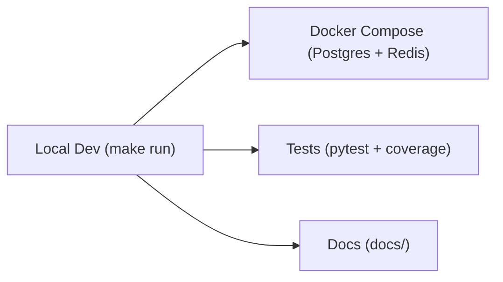

# FastAPI Boilerplate

# Production-ready FastAPI starter with async SQLAlchemy, Alembic migrations, Redis-backed caching and rate-limiting, structured logging, and Docker Compose.

See the full developer documentation in the `docs/` folder.



**Quick Start (recommended)**

1. Create environment file:

```bash
cp .env.example .env
```

2. Run with Docker Compose (Postgres + Redis):

```bash
docker compose up --build
```

3. Open the API docs:

- OpenAPI: http://localhost:8000/docs
- Health: http://localhost:8000/api/v1/health

**Local development (without Docker)**

```bash
make install       # create .venv and install deps
make run           # run uvicorn with auto-reload
```

**Test & Coverage**

```bash
make test          # run pytest (enforces coverage)
make coverage      # run tests and show coverage report
```

**Useful Make targets**

- `make install` — create virtualenv and install dependencies
- `make run` — start dev server (uvicorn --reload)
- `make serve` — start production server (gunicorn + uvicorn workers)
- `make docker-build` — build Docker image
- `make compose-up` / `make compose-down` — manage docker-compose
- `make fmt` / `make lint` / `make mypy` — formatting and checks

For full details and developer guides, see: [docs/index.md](docs/index.md)

## Project layout

```text
app/
  api/v1/          API routers (health, cache, users)
  core/            settings, logging, middleware, security
  db/              database session, base metadata
  models/          SQLAlchemy models
  repositories/    data access layer
  schemas/         Pydantic request/response schemas
  services/        Redis, cache & domain services
alembic/           database migrations
docs/              developer documentation and guides
tests/             test suite (httpx AsyncClient + ASGI)
Makefile           developer helper targets
requirements.txt   pinned runtime dependencies
```

## Contributing

Please read the contributing guide in `docs/contributing.md` for style, testing and PR guidance.

