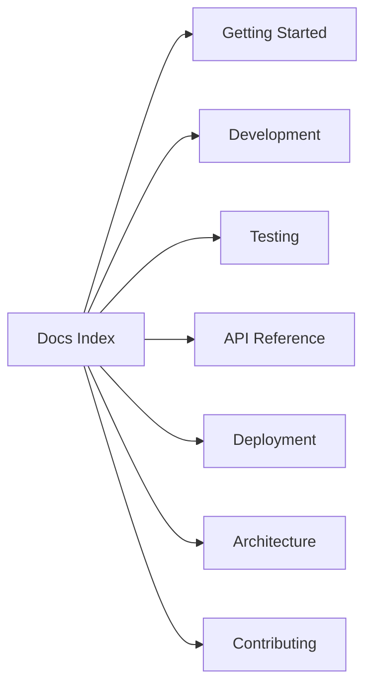

# Documentation — FastAPI Boilerplate

This folder contains developer documentation for the boilerplate.

Table of contents

- [Getting Started](getting-started.md)
- [Development Guide](development.md)
- [Testing](testing.md)
- [API Reference](api.md)
- [Deployment](deployment.md)
- [Architecture](architecture.md)
- [Contributing](contributing.md)

Start with [getting-started.md](getting-started.md) for local setup.
