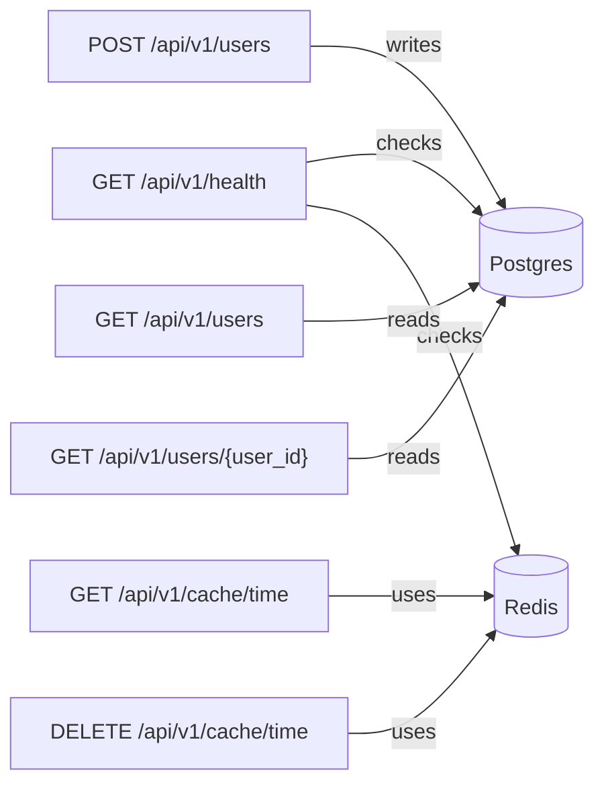

# API Reference

Base URL (local): `http://localhost:8000/api/v1`

Available endpoints

- `GET /api/v1/health`
  - Returns the health status of the app, DB and Redis.
  - Response: `{"status":"ok","database":"ok","redis":"ok"}`

- `GET /api/v1/cache/time`
  - Returns a cached timestamp (demo of CacheService).
  - Response: `{"generated_at": "2026-06-04T...Z"}`

- `DELETE /api/v1/cache/time`
  - Clears the cached value for the demo key.
  - Response: `{"message": "cache cleared"}`

- `POST /api/v1/users`
  - Create a new user.
  - Request JSON: `{"email": "user@example.com", "full_name": "User Name"}`
  - Success response (201): user object with `id`, `email`, `full_name`, `created_at`, `updated_at`.
  - Duplicate email returns 409 with `{"detail":"a user with this email already exists"}`.

- `GET /api/v1/users`
  - List users (query params: `limit`, `offset`).

- `GET /api/v1/users/{user_id}`
  - Get a single user by UUID; returns 404 if not found.

Interactive docs

- OpenAPI UI: `/docs`
- ReDoc: `/redoc` (if enabled)
