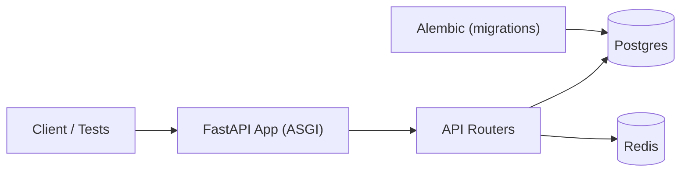

# Architecture

High-level components

- **FastAPI app (factory)** — `app/main.py` creates the app with lifespan-managed resources.
- **Database** — async SQLAlchemy (`SQLAlchemy 2.x`) and Alembic migrations. Session factory in `app/db/session.py`.
- **Redis** — used for caching and rate limiting; client and helper in `app/services/redis.py` and `app/services/cache.py`.
- **Middleware** — request context, structured logging, and rate-limiting are implemented in `app/core/middleware.py`.
- **Repositories** — `app/repositories/*` follow a simple repository pattern for DB access.

Design notes

- The app uses dependency injection (FastAPI `Depends`) to provide DB session and repository instances to routes.
- Lifespan handlers manage resource startup/shutdown (init/close Redis).
- Tests exercise the ASGI app directly using `httpx.ASGITransport` and do not require a running server.
