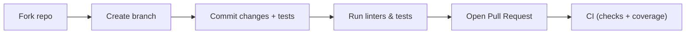

# Contributing

Thanks for contributing! Please follow these guidelines.

Development workflow

1. Fork the repo and create a topic branch.
2. Implement changes and add tests.
3. Run linters and tests locally:

        make fmt
        make lint
        make test

4. Open a PR with a clear description and link to related issues.

Code style

- Use `ruff` and `black` (via `make fmt`).
- Keep changes small and focused; write clear commit messages.

Testing & CI

- The repository enforces 100% coverage in CI. Add tests for new behavior and branches.

Pre-commit hooks

- Install pre-commit hooks with:

    make precommit-install
