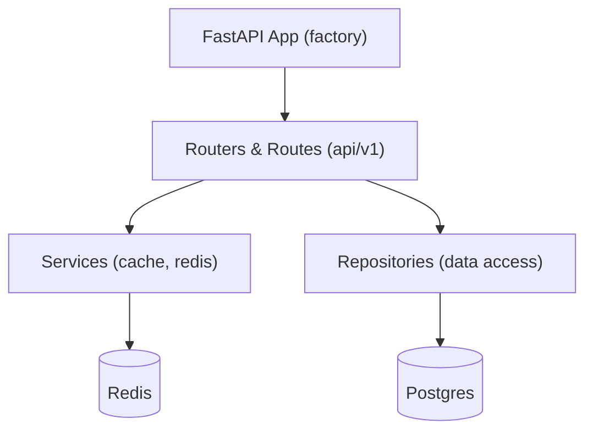

# Development Guide



Project structure

- `app/` — application code
  - `api/v1/` — routers and routes
  - `core/` — settings, middleware, logging, security
  - `db/` — database session, base
  - `models/` — SQLAlchemy models
  - `repositories/` — data access layer
  - `schemas/` — Pydantic schemas
  - `services/` — Redis/cache services

Coding conventions

- Use `ruff` for linting and formatting.
- Keep functions small and side-effect free where possible.

Adding an endpoint

1. Add a route under `app/api/v1/routes/` with an APIRouter.
2. Add business logic in `services/` or `repositories/` as appropriate.
3. Add request/response `schemas` to `app/schemas`.
4. Add tests in `tests/` using the `client` fixture and `app` fixture.

Running the app

```bash
make run
```
