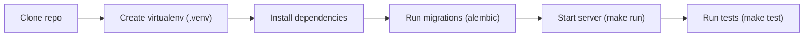

# Getting Started



Prerequisites

- Python 3.10+ (local development) or Docker Engine + Docker Compose
- Git

Quick start (Docker)

1. Copy environment example:

```bash
cp .env.example .env
```

2. Build and start services:

```bash
docker compose up --build
```

3. Visit the API docs: `http://localhost:8000/docs`

Quick start (local)

```bash
make install
make run
```

Notes

- The `Makefile` provides convenient targets for running, testing, and building images. Use `make help` to list targets.
- Environment variables are loaded from `.env` via `pydantic-settings`.
