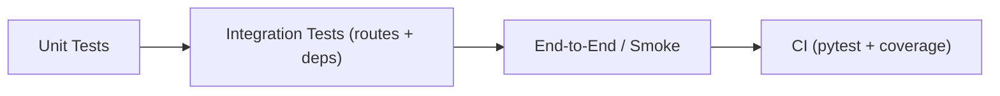

# Testing

Test philosophy

- Tests use `httpx.AsyncClient` with `ASGITransport` to exercise the FastAPI app in-process (no network).
- Fixtures in `tests/conftest.py` provide `client`, `app`, `fake_redis`, and helpers.

Run the full test suite

    make test

Run a single test file

    PYTHONPATH=$(pwd) .venv/bin/pytest tests/test_api.py -q

Run a single test function

    PYTHONPATH=$(pwd) .venv/bin/pytest tests/test_api.py::test_health_check -q -s

Generate coverage report

    make coverage

Tips for adding tests

1. Use the `client` fixture to send requests to the API.
2. Use `monkeypatch` to stub external dependencies (DB, Redis) when needed.
3. Add unit tests for small components (services, utilities) and integration tests for routes.
4. Run `make test` locally before opening PRs; CI enforces 100% coverage.
